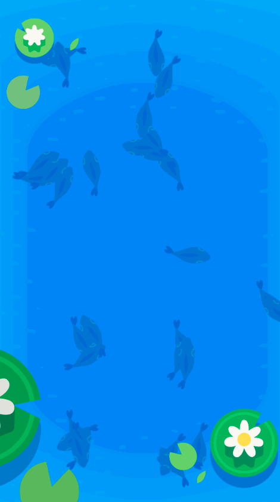
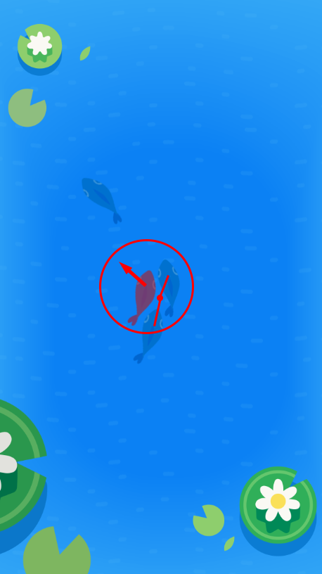
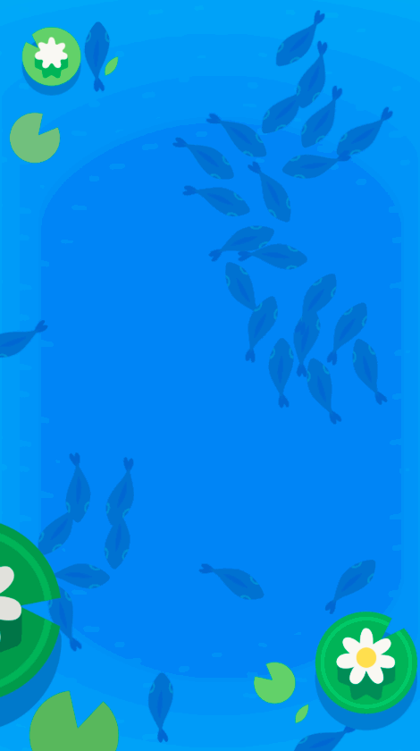

Now that we've completed the really math-y functions, we can get started on coding some of this swarm intelligence!

Our core swarm intelligence will involve three rules:

- Cohesion: sticking together
- Separation: avoiding collisions
- Alignment: mimicking neighbors

With these three, simple rules we'll start to observe an "emergent behavior". While the three rules are each simple on their own, the combination of them creates a complex system that closely mimics actual fish behavior!

# A quick introduction to delegates

# Cohesion: sticking together

## Success!

At the end of this rule you should see the fish clumping together...

# Separation: avoiding collisions

## Success!

At the end of this section you should see the fish clumping together but trying not to overlap...

# Alignment: mimicking neighbors

## Success!

At the end of this section you should see the fish clumping together, trying not to overlap, and mimicking the velocity of their neighbors! With all three of these rules together, we start to see schools of fish swimming around and combining with each other :)

